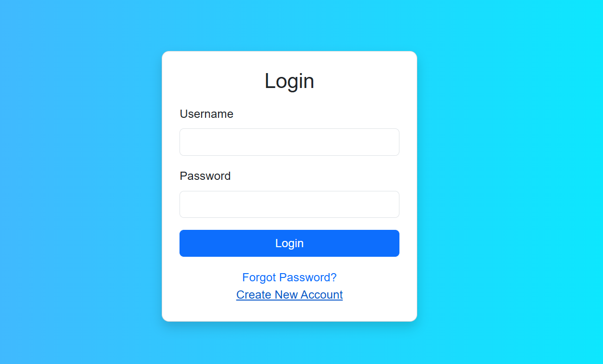
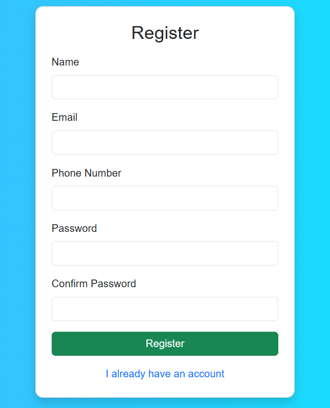
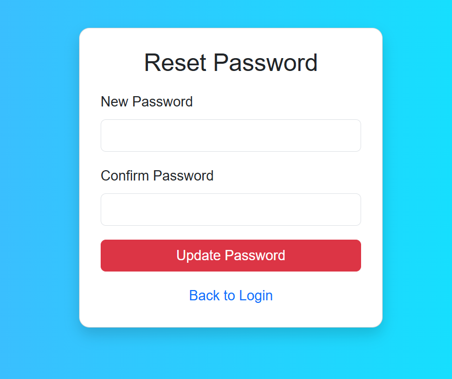
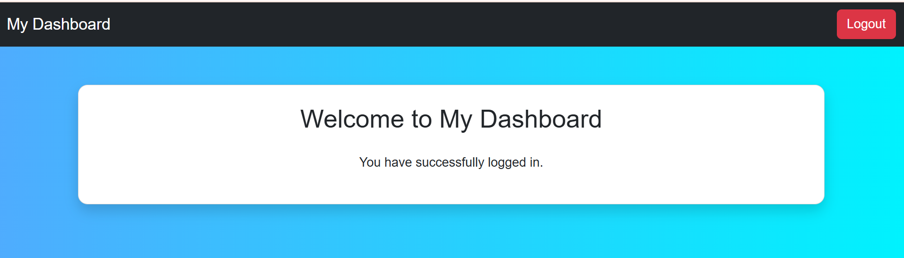

# Authentication System Styling

This project is a styled authentication system built using HTML, Bootstrap 5, and custom CSS.

## Pages

- Login Page
- Registration Page
- Forgot Password Page
- Reset Password Page
- Dashboard Page

## Technologies Used

- HTML5
- Bootstrap 5
- CSS3

## Features

- Responsive design
- Bootstrap cards and forms
- Styled buttons
- Dashboard with navbar
- Gradient background
- Hover effects

## Screenshots

### Login Page

### Register Page

### Forgot Password

### Reset Password

### Dashboard
